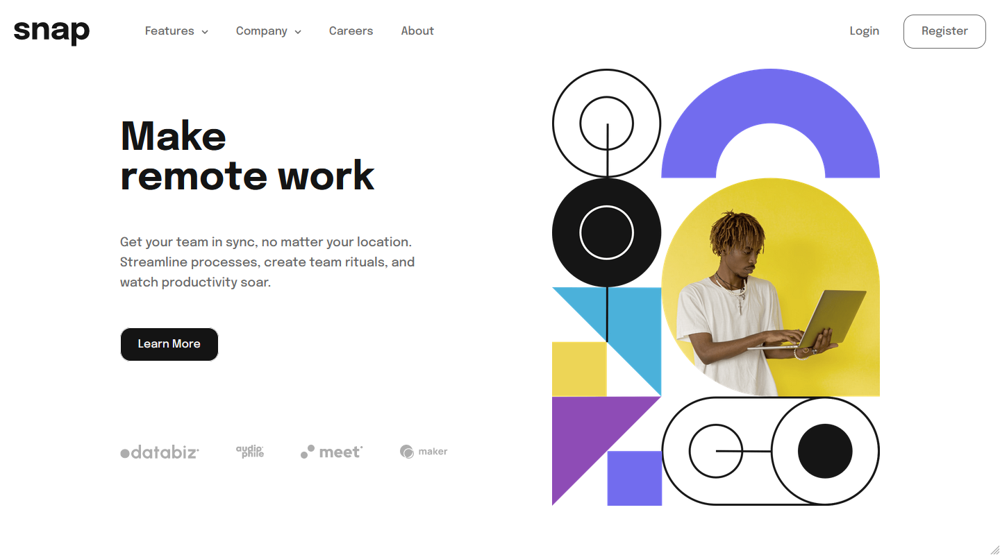

# Frontend Mentor - Intro section with dropdown navigation solution

This is a solution to the [Intro section with dropdown navigation challenge on Frontend Mentor](https://www.frontendmentor.io/challenges/intro-section-with-dropdown-navigation-ryaPetHE5). Frontend Mentor challenges help you improve your coding skills by building realistic projects.

## Table of contents

- [Overview](#overview)
  - [The challenge](#the-challenge)
  - [Screenshot](#screenshot)
  - [Links](#links)
- [My process](#my-process)
  - [Built with](#built-with)
  - [What I learned](#what-i-learned)
  - [Continued development](#continued-development)
  - [Useful resources](#useful-resources)
- [Author](#author)

## Overview

### The challenge

Users should be able to:

- View the relevant dropdown menus on desktop and mobile when interacting with the navigation links
- View the optimal layout for the content depending on their device's screen size
- See hover states for all interactive elements on the page

### Screenshot

### Links

- Solution URL: [Add solution URL here](https://your-solution-url.com)
- Live Site URL: [https://snap-intro-section-ai.netlify.app/](https://snap-intro-section-ai.netlify.app/)

## My process

### Built with

- Semantic HTML5 markup
- CSS custom properties
- Flexbox
- CSS Grid
- Mobile-first workflow
- SASS using SCSS syntax
- BEM naming convention

### What I learned

By building this project I practiced my SASS and CSS skills, specifically CSS Grid and Flexbox.

### Continued development

In the future I'd like to improve my CSS and SASS skills by building more projects.

### Useful resources

[BEM Naming Convention](http://getbem.com/naming/)  
[SASS 7-1 Architecture](https://www.learnhowtoprogram.com/user-interfaces/building-layouts-preprocessors/7-1-sass-architecture)

## Author

- Frontend Mentor - [@andrijaivkovic](https://www.frontendmentor.io/profile/andrijaivkovic)
- Twitter - [@AndrijaIvkovic1](https://www.twitter.com/AndrijaIvkovic1)
